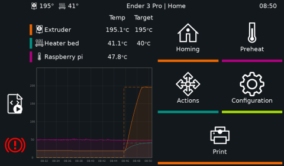

# KlipperScreen

KlipperScreen is a touchscreen GUI that interfaces with [Klipper](https://github.com/Klipper3d/klipper) via [Moonraker](https://github.com/arksine/moonraker). It allows you to switch between multiple printers and access them from a single location. Notably, it doesn't need to run on the same host as your printer; you can install it on another device and configure the IP address to connect to the printer.

### Documentation

For detailed information, [click here to access the documentation](https://klipperscreen.github.io/KlipperScreen/).

## Required printer macros for `toolchanger-ui`

The `toolchanger-ui` branch expects a small set of printer-side macros to exist for tool selection, tool drop, filament loading and unloading, PID tuning, and spool assignment persistence.

### What the UI expects

The toolchanger panel uses these commands:

- `T0`, `T1`, `T2`, `T3`, ... to select a tool
- `UNSELECT_TOOL` to drop the current tool
- `LOAD_FILAMENT TOOL=<n>` to load filament for a specific tool
- `UNLOAD_FILAMENT TOOL=<n>` to unload filament for a specific tool
- `PID_TUNE HEATER=<heater> TARGET=<temp>` from the settings popup

Each `Tn` macro must expose `variable_spool_id`, because KlipperScreen writes spool assignments into the macro with `SET_GCODE_VARIABLE MACRO=Tn VARIABLE=spool_id VALUE=...`.

### Notes

- The `LOAD_FILAMENT` and `UNLOAD_FILAMENT` wrappers below are important. The panel sends `TOOL=<n>`, so these macros should honor that parameter.
- Spool assignment support also expects `[save_variables]`, Moonraker toolchanger objects, and Spoolman to be configured.
- `job_status.py` can also use `Z_OFFSET_APPLY_PROBE` and `Z_OFFSET_APPLY_ENDSTOP` for its save-Z buttons, but those are optional and are not required for the main toolchanger panel.
- Duplicate the `Tn` pattern below for however many tools your machine uses.

### Recent toolchanger-ui refinements

Recent updates to the `toolchanger-ui` branch include:

- confirmation before activating a tool with no spool assigned
- automatic tool selection before load/unload actions
- numeric keypad entry in the per-tool temperature popup
- improved tool selection popup layout for better touchscreen usability

### Example macro pack

```ini

################################################################################
# REQUIRED MACROS FOR KLIPPERSCREEN TOOLCHANGER-UI
################################################################################


# ------------------------------------------------------------------------------
# DROP TOOL
# KlipperScreen calls UNSELECT_TOOL directly.
# Your toolchanger config must provide a working UNSELECT_TOOL command.
# ------------------------------------------------------------------------------


# ------------------------------------------------------------------------------
# TOOL SELECT MACROS
# Each tool macro must expose variable_spool_id because KlipperScreen writes it.
# ------------------------------------------------------------------------------

[gcode_macro T0]
variable_active: 0
variable_color: ""
variable_spool_id: 0
gcode:
    
    SELECT_TOOL T=0
    
        SET_GCODE_VARIABLE MACRO=T0 VARIABLE=spool_id VALUE={svv.t0__spool_id}
        SET_ACTIVE_SPOOL ID={svv.t0__spool_id} TOOL=0
    

[gcode_macro T1]
variable_active: 0
variable_color: ""
variable_spool_id: 0
gcode:
    
    SELECT_TOOL T=1
    
        SET_GCODE_VARIABLE MACRO=T1 VARIABLE=spool_id VALUE={svv.t1__spool_id}
        SET_ACTIVE_SPOOL ID={svv.t1__spool_id} TOOL=1
    

[gcode_macro T2]
variable_active: 0
variable_color: ""
variable_spool_id: 0
gcode:
    
    SELECT_TOOL T=2
    
        SET_GCODE_VARIABLE MACRO=T2 VARIABLE=spool_id VALUE={svv.t2__spool_id}
        SET_ACTIVE_SPOOL ID={svv.t2__spool_id} TOOL=2
    

[gcode_macro T3]
variable_active: 0
variable_color: ""
variable_spool_id: 0
gcode:
    
    SELECT_TOOL T=3
    
        SET_GCODE_VARIABLE MACRO=T3 VARIABLE=spool_id VALUE={svv.t3__spool_id}
        SET_ACTIVE_SPOOL ID={svv.t3__spool_id} TOOL=3
    


# ------------------------------------------------------------------------------
# PID TUNE
# Used by the Toolchanger panel PID popup.
# ------------------------------------------------------------------------------

[gcode_macro PID_TUNE]
description: PID tune heaters (HEATER=bed/extruder/extruder1/etc TARGET=temperature)
gcode:
  
  

  
    
    
  
    
      
      
        
      
        
      
    
    
  

  
    {action_respond_info("Starting PID calibration for %s at %d°C" % (HEATER, TARGET_TEMP))}
    PID_CALIBRATE HEATER={HEATER} TARGET={TARGET_TEMP}
    SAVE_CONFIG
  
    {action_respond_info("ERROR: Heater '%s' not found!" % HEATER)}
    {action_respond_info("Available heaters: %s" % (printer.heaters.available_heaters|join(', ')))}
  

# ------------------------------------------------------------------------------
# SPOOLMAN HELPERS
# Needed if you want spool assignment / restore / active spool sync to work.
# ------------------------------------------------------------------------------

[gcode_macro SET_ACTIVE_SPOOL]
gcode:
  
    
    
      
      {action_call_remote_method(
         "spoolman_set_active_spool",
         spool_id=id,
         tool=tool
      )}
    
      {action_call_remote_method(
         "spoolman_set_active_spool",
         spool_id=id
      )}
    
  
    {action_respond_info("Parameter 'ID' is required")}
  

[gcode_macro CLEAR_ACTIVE_SPOOL]
gcode:
  {action_call_remote_method(
    "spoolman_set_active_spool",
    spool_id=None
  )}

[delayed_gcode _load_spoolman_variables]
initial_duration: 3
gcode:
    

    
        SET_ACTIVE_SPOOL ID={svv.t0__spool_id} TOOL=0
        SET_GCODE_VARIABLE MACRO=T0 VARIABLE=spool_id VALUE={svv.t0__spool_id}
    

    
        SET_ACTIVE_SPOOL ID={svv.t1__spool_id} TOOL=1
        SET_GCODE_VARIABLE MACRO=T1 VARIABLE=spool_id VALUE={svv.t1__spool_id}
    

    
        SET_ACTIVE_SPOOL ID={svv.t2__spool_id} TOOL=2
        SET_GCODE_VARIABLE MACRO=T2 VARIABLE=spool_id VALUE={svv.t2__spool_id}
    

    
        SET_ACTIVE_SPOOL ID={svv.t3__spool_id} TOOL=3
        SET_GCODE_VARIABLE MACRO=T3 VARIABLE=spool_id VALUE={svv.t3__spool_id}
    


# ------------------------------------------------------------------------------
# FILAMENT LOAD / UNLOAD WRAPPERS
# The UI calls LOAD_FILAMENT TOOL=n and UNLOAD_FILAMENT TOOL=n.
# These wrappers forward to the per-tool implementations.
# ------------------------------------------------------------------------------

[gcode_macro LOAD_FILAMENT]
description: Load filament for a specific tool or current tool
gcode:
  
  
  
    LOAD_ONE_FILAMENT TOOL={TOOL_NUM} TEMP={TEMP_ARG}
  
    LOAD_ONE_FILAMENT TOOL={TOOL_NUM}
  

[gcode_macro UNLOAD_FILAMENT]
description: Unload filament for a specific tool or current tool
gcode:
  
  
  
    UNLOAD_ONE_FILAMENT TOOL={TOOL_NUM} TEMP={TEMP_ARG}
  
    UNLOAD_ONE_FILAMENT TOOL={TOOL_NUM}
  
```

### Required supporting config

At minimum, users should also have:

```ini

[save_variables]
filename: ~/printer_data/config/saved_variables.cfg


Add this to your KlipperScreen menu config to show the **Tools** button on the main menu:

[menu __main toolchanger]
name: Tools
icon: extruder
panel: toolchanger

[printer]
titlebar_items: Chamber

```

Users also need a working toolchanger setup in Klipper/Moonraker plus Spoolman integration for spool assignment and spool restore to function correctly.

### Inspiration

KlipperScreen draws inspiration from [OctoScreen](https://github.com/Z-Bolt/OctoScreen/) and was developed to provide a native touchscreen GUI compatible with [Klipper](https://github.com/Klipper3d/klipper) and [Moonraker](https://github.com/arksine/moonraker).

[](https://klipperscreen.readthedocs.io/en/latest/Panels/)

Explore more screenshots [here](https://klipperscreen.readthedocs.io/en/latest/Panels/).

### Translations

Translations for KlipperScreen are hosted on Weblate. Thanks to the Weblate team for supporting the open-source community.

<a href="https://hosted.weblate.org/engage/klipperscreen/">
    
</a>

Click the widget below to access the translation platform:

<a href="https://hosted.weblate.org/engage/klipperscreen/">
    
</a>

### About the Project

KlipperScreen was created by Jordan Ruthe in 2020.

| Donate to Jordan |
|------------------|
| [Patreon](https://www.patreon.com/klipperscreen) |
| [Ko-fi](https://ko-fi.com/klipperscreen) |

Since 2021, the project has been maintained by Alfredo Monclus (alfrix).

| Donate to Alfrix |
|------------------|
| [Ko-fi](https://ko-fi.com/alfrix) |

We extend our gratitude to all contributors who have helped along the way. [Meet the contributors](https://github.com/KlipperScreen/KlipperScreen/graphs/contributors).

### Sponsors

 

Special thanks to [LDO](https://ldomotors.com/) and [YUMI](https://wiki.yumi-lab.com/) for sponsoring KlipperScreen and the open-source community.
