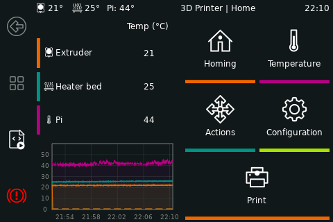

# KlipperScreen

KlipperScreen is a touchscreen GUI that interfaces with [Klipper](https://github.com/kevinOConnor/klipper) via [Moonraker](https://github.com/arksine/moonraker). It can switch between multiple printers to access them from a single location, and it doesn't even need to run on the same host, you can install it on another device and configure the IP address to access the printer.

### Documentation 

[Click here to access the documentation.](https://klipperscreen.readthedocs.io/en/latest/)

### Inspiration
KlipperScreen was inspired by [OctoScreen](https://github.com/Z-Bolt/OctoScreen/) and the need for a touchscreen GUI that
will natively work with [Klipper](https://github.com/kevinOConnor/klipper) and [Moonraker](https://github.com/arksine/moonraker).

[More Screenshots](https://klipperscreen.readthedocs.io/en/latest/Panels/)