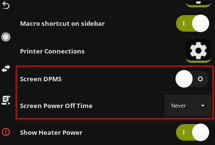

# XServer-XSDL (Android Only)

This article describe how to use KlipperScreen from an Android device using XServer-XSDL

!!! warning
    The experience may not be equal to run KlipperScreen natively.
    Depending on the device or the network you may encounter performance degradation or other issues.

!!! bug
    This method may cause [memory-leaks](https://github.com/KlipperScreen/KlipperScreen/issues/862)

    It's recommended that you use [VNC](VNC.md) instead or at least install [earlyoom](https://packages.debian.org/en/stable/earlyoom)


1. [First install KlipperScreen](Installation.md)

2. Download the apk of XServer-XSDL or ViewTouch from the [official sourceforge](https://sourceforge.net/projects/libsdl-android/files/apk/XServer-XSDL/).

    since it's no longer on the play store.

    With Android 4 you may have to use v1.11.40

3. Install the app on the Android device

4. Choose [USB (ADB)](#adb) or [WI-FI](#wifi)

### ADB

!!! warning
    Leaving the phone always connected it's not recommended, remove the battery to avoid issues.

1. Install ADB on the computer/SBC/Pi with this command:
    ```bash
    sudo apt-get install android-tools-adb
    ```
2. Put your Android device in Debug mode.

    Usually it involves enabling developer mode and "USB debugging"
    the exact method varies on different vendors and versions of the device

    search "how to enable Android debugging on device-model-and-brand"

3. Copy the sample launcher script with the following commands:

    ```bash
    cd ~/KlipperScreen/scripts
    cp sample-android-adb.sh launch_KlipperScreen.sh
    chmod +x ~/KlipperScreen/scripts/launch_KlipperScreen.sh
    ```

4. Start Xserver-XSDL On the Android device

5. Go to [Startup](#startup)

### WIFI

1. Create a launcher script by entering the following commands:

    ```bash
    rm ~/KlipperScreen/scripts/launch_KlipperScreen.sh
    touch ~/KlipperScreen/scripts/launch_KlipperScreen.sh
    chmod +x ~/KlipperScreen/scripts/launch_KlipperScreen.sh
    nano ~/KlipperScreen/scripts/launch_KlipperScreen.sh
    ```

2. Start the app on the Android device (Xserver-XSDL or ViewTouch)
3. Paste this into the script:

    Replace the example IP with the one that Android app shows in the screen.
    ```bash
    DISPLAY=192.168.150.122:0 $KS_XCLIENT
    ```

!!! important
    It's recommended to use a static IP address, because if it changes your connection will stop working.

## Startup

Enter this command on the computer/SBC/Pi
```bash
sudo service KlipperScreen restart
```

## Doesn't start

Follow this steps:

1. Reboot the Android device
2. Open the XSDL app and leave it waiting in the blue-screen
3. Reboot the computer/SBC/Pi

## Xserver-XSDL config

Some versions of the app require this configuration to work as expected.

On the splash-screen of the app go to:
```
“CHANGE DEVICE CONFIGURATION”
└──Mouse Emulation Modde
    └──Desktop, No Emulation
```
if you missed it, restart the app.

## Recommended configuration for this use case

It's recommended to set Display timeout to never:

Also for X11 installs turn off DPMS:



## Stop Screen Blanking in Xserver-XSDL

Even after enabling the "Stay Awake" option in the Developer/USB Debugging options of your Android device,
the Xserver-XSDL may still go to a black screen but keep the backlight of your device on.
To keep the screen always active, upon start up of Xserver-XSDL app, select the `Change Device Configuration`
at the top of the splash screen and then select the `Command line parameters, one argument per line` option.
Append the following argument (must be on separate lines):
```
-s
0
```
This will disable the screen-saver in Xserver and keep KlipperScreen always active.

## Migration from other tutorials

KlipperScreen says error option "service" is not supported anymore.

Stop the other service and Remove it, for example if the service is `KlippyScreenAndroid`:

```bash
sudo service KlippyScreenAndroid stop
sudo rm /etc/systemd/system/KlippyScreenAndroid.service
```

Follow this guide on how to set up the new launcher script with [USB(ADB)](#adb) or [WI-FI](#wifi) and restart KS.

## Help

[The Discourse thread has old instructions, but you may get some help if needed](https://klipper.discourse.group/t/how-to-klipperscreen-on-android-smart-phones/1196)

[#klipper-screen channel on Discord](https://discord.klipper3d.org/)

