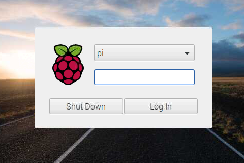

# Frequently Asked Questions

## What is the minimum Python version required?

The minimum version is Python 3.7, this is checked during install.

##  OctoPrint?

KlipperScreen was not designed to work with OctoPrint and there are no plans to make it compatible.

## How to Check if You Have a Desktop Environment
1. Let you device finish startup
2. At the end of the boot process look at the screen and check using this examples


|            Desktop environment             |                   Console                    |
|:------------------------------------------:|:--------------------------------------------:|
|      |         |
|            Desktop environment             |                   Console                    |
|     |     |

## Can i use KlipperScreen as a desktop application?

Yes, First disable the service:

```shell
sudo systemctl disable KlipperScreen
```

and open the application via the menu when you need it.


you can also find the shortcut in `KlipperScreen/scripts/KlipperScreen.desktop`

## Titlebar turned red and says CPU and RAM

It's the high resource warning system, having your printer with very high usage of CPU or RAM will lead to issues,
usually involving timer too close in klipper, if it appears during an update or some maintanance process, it should not be an issue,
just don't start printing until it clears.

