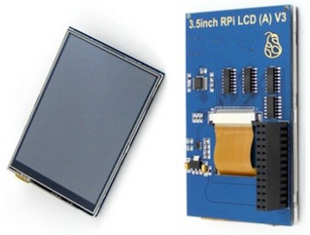

How i installed the 3.5" (A) type of screen on RaspberryOS Bookworm (Debian 12)

Update: I've tested Bullseye (Debian 11) and it works, but [rotation was not working](#rotation)



!!! abstract "Disclaimer"
    This is based on my own experience, and it's provided for general information
    and does not constitute as advice of any kind.


## Initial install

This screens connect to the [GPIO](https://en.wikipedia.org/wiki/General-purpose_input/output)
they were usually installed via  repositories named LCD-show ([1](https://github.com/waveshare/LCD-show), [2](https://github.com/goodtft/LCD-show)),
however in the bookworm release there is a simpler solution

```sh
sudo nano /boot/firmware/config.txt
```
at the bottom add:
```
dtoverlay=piscreen,drm
```

???+ info
    in this context drm stands for [Direct Rendering Manager](https://en.wikipedia.org/wiki/Direct_Rendering_Manager)

I had to comment out (add # at the start) vc4 or it would boot into a blackscreen

```
#dtoverlay=vc4-kms-v3d
```

Close the nano editor using `ctrl`+`x` (exit), then `y` for yes (save).

```sh
sudo reboot
```

## Wrong colors or graphical corruption

Some screens will not behave correctly and/or display wrong colors,
this usually due to the wrong [SPI](https://en.wikipedia.org/wiki/Serial_Peripheral_Interface) speed
In my case the maximum i could achieve is 22.22Mhz
```
dtoverlay=piscreen,drm,speed=22222222
```

??? info "About speed"

    As you may predict speed has a big impact in usability as it dictates how often the display will refresh

    If i understand the [involved drivers](https://github.com/torvalds/linux/blob/65d287c7eb1d14e0f4d56f19cec30d97fc7e8f66/drivers/spi/spi-bcm2835.c#L1068)
    correctly, the spi speed is calculated as:
    `core_clock / core_divisor`

    The divisor must be a multiple of 2, that ranges between 2 and 65536

    Core clock in the case of Pi 3 would be 400mhz

    So even if you can enter any number, it will be approximated to a value from that formula

    That's why i used 22.222.222 (400 / 18)

reboot to test any changes.

## Rotation

You can rotate the screen adding a rotate line with the degrees [0, 90, 180, 270]
```
dtoverlay=piscreen,drm,rotate=180
```
Screen rotation will require adjusting the touch matrix see [Touch issues](../../Troubleshooting/Touch_issues/)

!!! bug

    Raspberry linux Kernel v6.1.77 has a bug in the dtb and rotate doesn't work

    The fix has been merged in linux v6.6

    you can copy the dtb from the new kernel into the old one if needed

## Console

To make the console work:

```sh
sudo nano /boot/firmware/cmdline.txt
```

add at the start or end:

```
fbcon=map:11
```

!!! warning "Important"
    Do not add newlines to the file,  it must be 1 line with the options separated by spaces

## Type (B-v2)

I have tried the type (B) version 2, and it's quite different, this screen has a different initialization sequence,
probably due to being IPS

so you will need the waveshare35b-v2 dtb of the [waveshare repo](https://github.com/waveshare/LCD-show), to be copied into the apropriate folder

```
git clone https://github.com/waveshare/LCD-show
sudo cp LCD-show/waveshare35b-v2-overlay.dtb /boot/firmware/overlays/waveshare35b-v2.dtbo
```

the config would be something like this, another major difference is that this display will default to vertical

the maximum speed i could achieve with mine was 33mhz (400mhz/12) without color aberration,
but i ended up with 30mhz to have some margin
this overlay supports an fps value, default is 30 i changed it to 60
this screen was never super responsive but with this configuration is quite tolerable in my opinion.

``` title="/boot/firmware/config.txt"
dtoverlay=waveshare35b-v2:rotate=270,drm,speed=30000000,fps=60
```

```ini title="example of dmesg output"
...
[   14.926080] input: ADS7846 Touchscreen as /devices/platform/soc/3f204000.spi/spi_master/spi0/spi0.1/input/input0
[   15.015895] fbtft: module is from the staging directory, the quality is unknown, you have been warned.
[   15.021701] fb_ili9486: module is from the staging directory, the quality is unknown, you have been warned.
[   15.022279] SPI driver fb_ili9486 has no spi_device_id for ilitek,ili9486
[   15.022555] fb_ili9486 spi0.0: fbtft_property_value: regwidth = 16
[   15.022572] fb_ili9486 spi0.0: fbtft_property_value: buswidth = 8
[   15.022588] fb_ili9486 spi0.0: fbtft_property_value: debug = 0
[   15.022600] fb_ili9486 spi0.0: fbtft_property_value: rotate = 270
[   15.022615] fb_ili9486 spi0.0: fbtft_property_value: fps = 60
[   15.022627] fb_ili9486 spi0.0: fbtft_property_value: txbuflen = 32768
[   15.826386] graphics fb1: fb_ili9486 frame buffer, 480x320, 300 KiB video memory, 32 KiB buffer memory, fps=62, spi0.0 at 30 MHz
...
```

by default with this configuration the output will be on the secondary framebuffer
so a file must be created to address this issue:

``` title="/usr/share/X11/xorg.conf.d/99-fbdev.conf"
Section "Device"
        Identifier      "Allwinner A10/A13 FBDEV"
        Option          "fbdev" "/dev/fb1"
        Option          "SwapbuffersWait" "true"
EndSection
```

!!! tip
    notice that i'm using fbdev and not fbturbo, you can use fbturbo if you like (remeber to install it)


at this point this still did not work:

```ini title="example of /var/log/Xorg.0.log"
[   172.061] (II) LoadModule: "modesetting"
[   172.061] (II) Loading /usr/lib/xorg/modules/drivers/modesetting_drv.so
[   172.064] (II) Module modesetting: vendor="X.Org Foundation"
[   172.064]    compiled for 1.21.1.7, module version = 1.21.1
[   172.064]    Module class: X.Org Video Driver
[   172.064]    ABI class: X.Org Video Driver, version 25.2
[   172.065] (II) modesetting: Driver for Modesetting Kernel Drivers: kms
[   172.067] (WW) Falling back to old probe method for modesetting
[   172.068] (EE) open /dev/dri/card0: No such file or directory
[   172.068] (WW) Falling back to old probe method for modesetting
[   172.068] (EE) open /dev/dri/card0: No such file or directory
[   172.068] (EE) No devices detected.
[   172.068] (EE)
Fatal server error:
[   172.068] (EE) no screens found(EE)

```
so i checked out the configuration and found:

``` title="default contents of /usr/share/X11/xorg.conf.d/20-noglamor.conf"
Section "Device"
	Identifier "kms"
	Driver "modesetting"
	Option "AccelMethod" "msdri3"
	Option "UseGammaLUT" "off"
EndSection
```
did:
```
sudo nano /usr/share/X11/xorg.conf.d/20-noglamor.conf
```
deleted everything and saved.

then removed the write permissions to prevent being regenerated:
```
sudo chmod 444 /usr/share/X11/xorg.conf.d/20-noglamor.conf
```

at this point the screen was working, but the touchscreen needed to be rotated:

``` title="rules for rotation: /etc/udev/rules.d/51-touchscreen.rules"
ACTION=="add", ATTRS{name}=="ADS7846 Touchscreen", ENV{LIBINPUT_CALIBRATION_MATRIX}="0 1 0 -1 0 1 0 0 1"
```

after a reboot the waveshare type b rev2 was working perfectly at this point.
