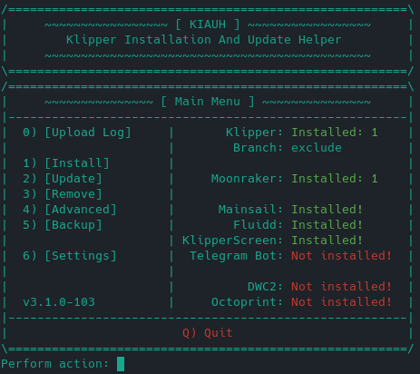

# Installation

## First steps

Install the screen, following the instructions provided by the manufacturer, Some screens don't neeed extra software but some need to be installed with a script.
It's strongly recommended to test it and ensure your hardware is working with Raspbian, Ubuntu or any distro you like.
Once you stablished that the screen is working, then proceed installing KlipperScreen.

## Setup
This install process is meant for a non-desktop version of the OS for example Raspbian Lite, but it should work on other versions.

If you want to use it on a desktop (GUI version), then do `sudo systemctl set-default multi-user.target`
if it's a Raspberry Pi, you can use `sudo raspi-config` to set boot to console by choosing the following options in order:

```sh
1System Options
└──S5 Boot / Auto Login
   └──B1 Console
```

## Auto install

[KIAUH](https://github.com/th33xitus/kiauh) is a tool that helps you install or upgrade Klipper, Moonraker, Mainsail, and other extensions.



You can visit [KIAUH on GitHub](https://github.com/th33xitus/kiauh) to learn more and view its documentation.


## Manual Install

First install [Klipper](https://www.klipper3d.org/Installation.html) and [Moonraker](https://moonraker.readthedocs.io/en/latest/installation/).

### KlipperScreen Installation
Execute the following commands:

```sh
cd ~/
git clone https://github.com/jordanruthe/KlipperScreen.git
cd ~/KlipperScreen
./scripts/KlipperScreen-install.sh
```

This script will install packages that are listed under manual install, create a python virtual environment at
`~/.KlipperScreen-env` and install a systemd service file.

If you need a custom location for the configuration file, you can add -c or --configfile to the systemd file and specify
the location of your configuration file.

At this point KlipperScreen should be working, if it doesn't start then go to the [troubleshooting page](Troubleshooting.md)

## Moonraker configuration

In moonraker.conf ensure that 127.0.0.1 is a trusted client:

```py
[authorization]
trusted_clients:
  127.0.0.1
```
!!! warning
    `force_logins: true` requires the moonraker api key in [KlipperScreen.conf](Configuration.md)

If you wish to use the update manager feature of moonraker for KlipperScreen, add the following block to the moonraker.conf:

```py
[update_manager KlipperScreen]
type: git_repo
path: ~/KlipperScreen
origin: https://github.com/jordanruthe/KlipperScreen.git
env: ~/.KlipperScreen-env/bin/python
requirements: scripts/KlipperScreen-requirements.txt
install_script: scripts/KlipperScreen-install.sh
managed_services: KlipperScreen
```
!!! note
    If you see warnings in other UIs ignore them until KlipperScreen finishes installing.
