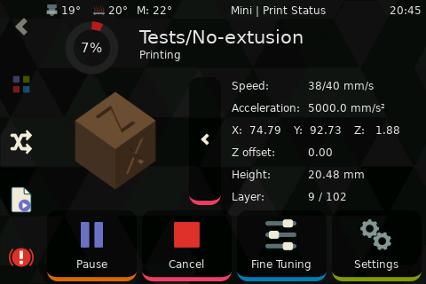
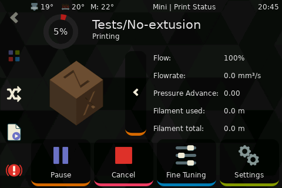
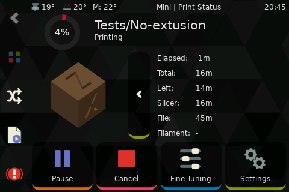

# Job Status

Also known as "Print Status" or the "printing panel" shows the relevant information of the current print.

!!! tip
    the third row shows the LCD message (`M117`)

This panel has more information than it shows by default, just click/tap the corresponding the status buttons to access the extra information

## Position info

!!! note
    Layer is calculated from object height, it may not be accurate if variable layer is used

    If that is the case use the Layer Progress method described in the [Quicktips](Quicktips.md#layer-progress)

## Extrusion info

## Time info

## Extra temperature items

By default only extruder and bed temperatures will be available but additional items can be defined
using ["titlebar_items" in the config](Configuration.md#printer-options)
