# Panels

### Main Menu
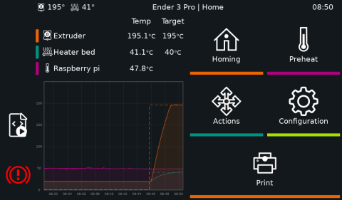

### [Job Status](Job_status.md)
```py
panel: job_status
```
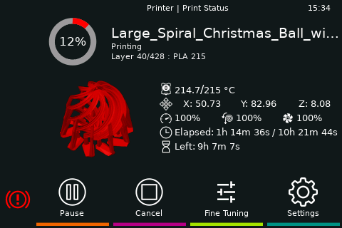

### [Bed Level](Screws.md)
```py
panel: bed_level
```
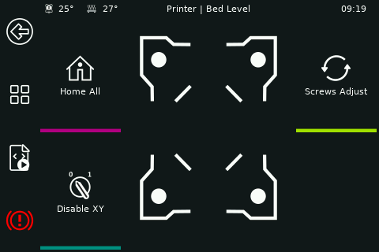

### Bed Mesh
```py
panel: bed_mesh
```
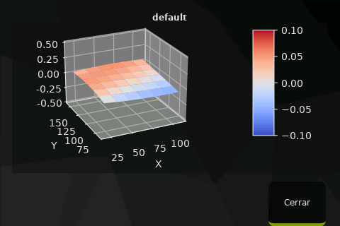

### Console
```py
panel: console
```
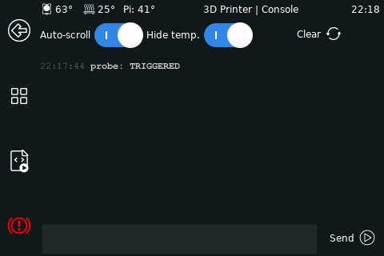

### Extrude
```py
panel: extrude theme:material-dark
```
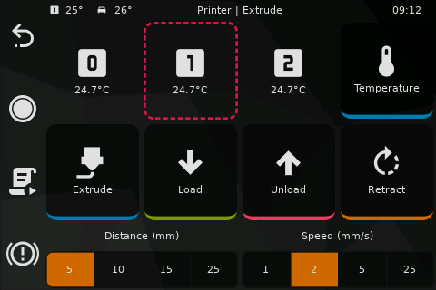

### Fan
```py
panel: fan
```


### Fine Tune
```py
panel: fine_tune
```
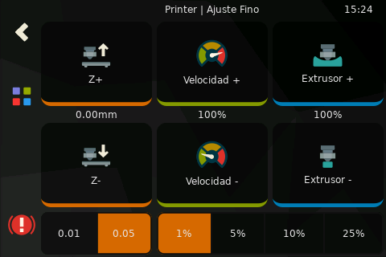

### Gcode Macros
```py
panel: gcode_macros
```
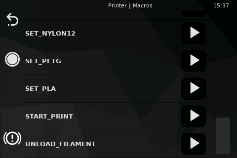

### Input Shapers
```py
panel: input_shaper
```


### Limits
```py
panel: limits
```
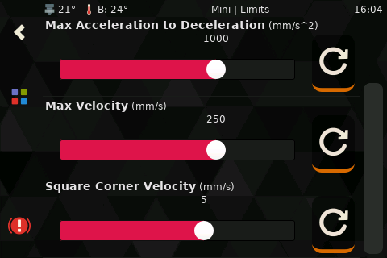

### Menu
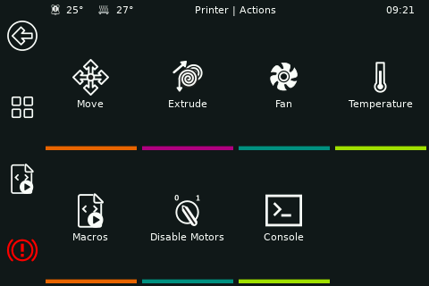

### Move
```py
panel: move
```
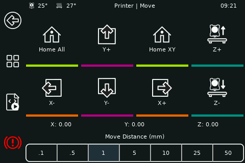

### Network
```py
panel: network
```
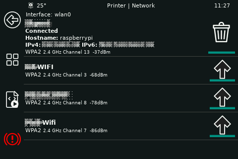

### Power
```py
panel: power
```
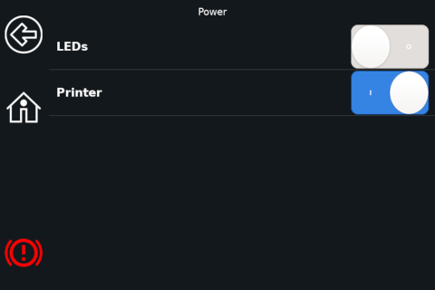

### Print
```py
panel: print
```
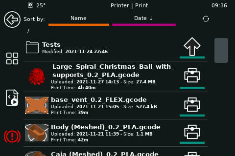

### Retraction
```py
panel: retraction
```


### Settings
```py
panel: settings
```


### System
```py
panel: system
```
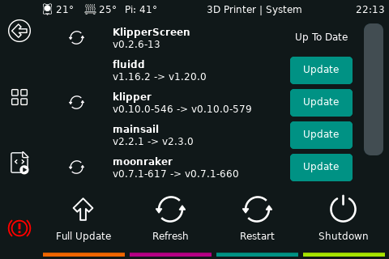

### [Temperature](Temperature.md)
```py
panel: temperature
```


### [Z Calibrate](Zcalibrate.md)
```py
panel: zcalibrate
```
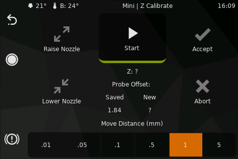
