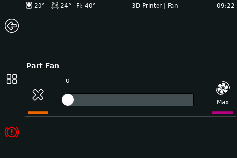
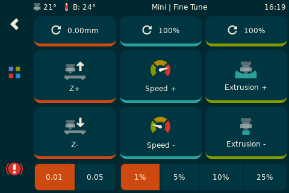
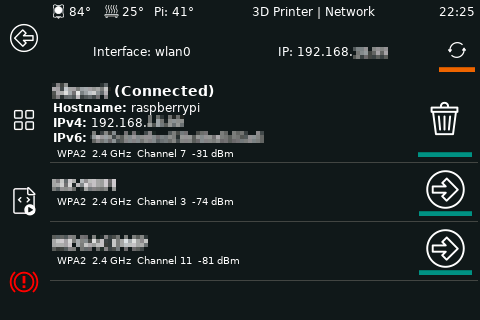
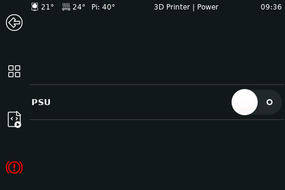

# Panels

### Main Menu

### Job Status

### Bed Level
type: bed_level

The bed level panel has the ability to have preset locations from Klipper. Please see documentation on the following
Klipper Sections:
* [bed_screws](https://www.klipper3d.org/Config_Reference.html#bed_screws)
* [screws_tilt_adjust](https://www.klipper3d.org/Config_Reference.html#screws_tilt_adjust)

_Important Note: Due to Klipper using the bltouch/probe offsets in screws_tilt_adjust, if a bltouch/probe is enabled_
_KlipperScreen will add the offset to the defined screw values. This will not occur if bed_screws section is used._

This panel will favor screws_tilt_adjust over the bed_screws section. If screws_tilt_adjust is defined, an extra button
for _Screws Calibrate_ will appear. This button runs the SCREWS_TILT_CALCULATE command and shows the results on the
panel.

### Bed Mesh
type: bed_mesh theme:material-dark

### Extrude
type: extrude theme:material-dark

### Fan
type: fan

### Fine Tune
type: fine_tune theme:custom

### Gcode Macros
type: gcode_macros theme: material-darker

### Menu
type: menu

### Move
type: move

### Network
type: network

### Power
type: power

### Print
type: print

### Settings
type: settings theme:colorized

### System
type: system

### Temperature
type: temperature theme:custom

### Z Calibrate
type: zcalibrate

### Limits
type: limits theme: material-dark

