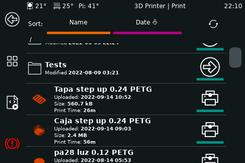
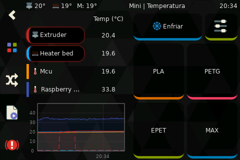

# Panels

### Main Menu


### Job Status
```py
panel: job_status
```


### Bed Level
```py
panel: bed_level
```


The bed level panel has the ability to have preset locations from Klipper. Please see documentation on the following
Klipper Sections:
* [bed_screws](https://www.klipper3d.org/Config_Reference.html#bed_screws)
* [screws_tilt_adjust](https://www.klipper3d.org/Config_Reference.html#screws_tilt_adjust)

_Important Note: Due to Klipper using the bltouch/probe offsets in screws_tilt_adjust, if a bltouch/probe is enabled_
_KlipperScreen will add the offset to the defined screw values. This will not occur if bed_screws section is used._

This panel will favor screws_tilt_adjust over the bed_screws section. If screws_tilt_adjust is defined, an extra button
for _Screws Calibrate_ will appear. This button runs the SCREWS_TILT_CALCULATE command and shows the results on the
panel.

### Bed Mesh
```py
panel: bed_mesh
```


### Extrude
```py
panel: extrude theme:material-dark
```


### Fan
```py
panel: fan
```


### Fine Tune
```py
panel: fine_tune
```


### Gcode Macros
```py
panel: gcode_macros
```


### Menu


### Move
```py
panel: move
```


### Network
```py
panel: network
```


### Power
```py
panel: power
```


### Print
```py
panel: print
```


### Settings
```py
panel: settings
```


### System
```py
panel: system
```


### Temperature
```py
panel: temperature
```


### Z Calibrate
```py
panel: zcalibrate
```


### Limits
```py
panel: limits
```


### Retraction
```py
panel: retraction
```


### Input Shapers
```py
panel: input_shaper
```

