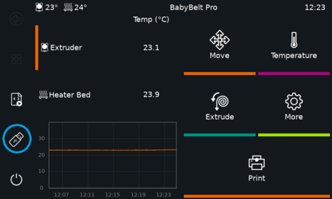
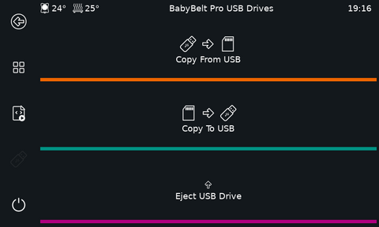
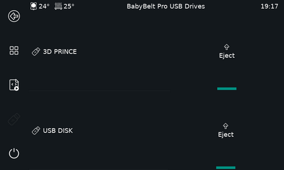
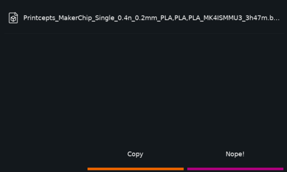
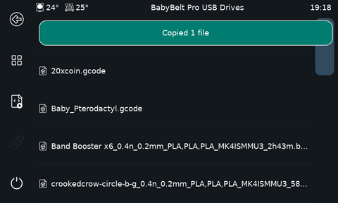
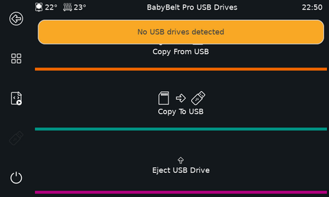

# USB Copy

This was created for those who have their printers on the go and may not have the ability to plug it in to a network to grab a file from it or copy a file to it.

The option has been added to the left navigation menu, while in the USB copy mode the back button on the left panel can be used to return to the previous screen.

The workflow is simple, Upon inserting a USB drive in a format that your machine can read, it will automatically mount. 
Going into the menu you will see three choices. 

Upon picking the "direction" of the copy operation, you will be either presented with a list of USB drives or if only one is connected you will go straight to the list of files. 
From the select menu you can also choose to eject a drive. If you have only inserted one, you will need to use the Eject USB Drive Menu.

Once a file is selected you will be prompted to confirm your choice. 

after the copy is completed, you will see the notification that the copy has been completed successfully.

If you have not connected any USB drives or attempt to proceed through the menus after ejecting, you will receive the warning that no drives are connected. 

Things to note: 
* If you want to use a drive again that you had previously ejected, please remove and reconnect the drive physically. 
* Copying of files is disabled during a print job. 
* You will be prompted before ejecting a USB drive.