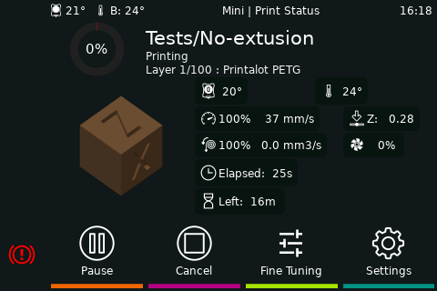
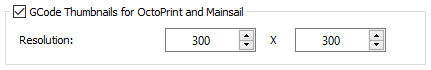

# Quicktips
quick tips, without much explanation


## Hide macros, outputs or fans
As you probably already noticed, you can show and hide the gcode macros in the interface settings,
but you can also hide gcode macros by prefixing the name with an underscore.

```
[gcode_macro MY_AWESOME_GCODE]
gcode:
    _MY_HELPER_CODE
[gcode_macro _MY_HELPER_CODE]
gcode:
    M300
```

MY_AWESOME_GCODE appears in your interface settings, _MY_HELPER_CODE not.

Another example:

Lets hide a temperature_fan:

```
[temperature_fan fan1]
[temperature_fan _fan2]
```

fan1 will show in the interface, but _fan2 will be hidden.


## Thumbnails
KlipperScreen can display thumbnails in the file browser and as previews in the print status.





* [PrusaSlicer](#PrusaSlicer)
* [SuperSlicer](#SuperSlicer)
* [Cura](#Cura)
* [ideaMaker](#ideaMaker)

### PrusaSlicer
In “Expert” mode PrusaSlicer has an option in the “Printer Settings” tab to activate previews.
Under General / Firmware.


### SuperSlicer
In “Expert” mode SuperSlicer has some very convenient options in the “Printer Settings” tab to activate and customize the previews.


### Cura
The Cura plugin [“Cura2Moonraker”](https://github.com/emtrax-ltd/Cura2MoonrakerPlugin) is required for this.


### ideaMaker
To enable thumbnails, open the Advanced tab in the printer settings, enable the GCode Thumbnails for Octoprint and Mainsail option and enter your prefered square format image size in the Resolution fields (e.g. 400 X 400). It’s necessary that the thumbnail width and height resolution is equal.





## Supported Macros
[Macros](macros.md)
