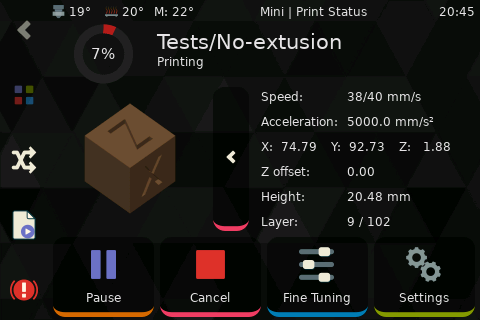

# Quicktips
quick tips, without much explanation


## Hide macros, outputs or fans

You can also hide devices by prefixing the name with an underscore.

Lets hide a temperature_fan:

```ini
[temperature_fan fan1]
[temperature_fan _fan2]
```

fan1 will show in the interface, but _fan2 will be hidden.


## Layer Progress

### Accurate layer progress as a message below the status:

#### PrusaSlicer

* Open PrusaSlicer
* Go to: `Printer Settings` > `Custom Gcode` > `After layer change Gcode`
* Add this:

```ini
M117 Layer {layer_num+1}/[total_layer_count] : {filament_settings_id[0]}
```


#### Cura

Install the extension: `Display Filename and Layer on LCD`


#### IdeaMaker

* Open IdeaMaker
* Got to: `Slice` > `Manage templates` > `Click on your template` > `Edit`
* Select the tab named `Gcode` > `Layer Change Gcode`
* Paste this:

```ini
M117 Layer {layer_index} / {total_layers}
```

### Accurate layer progress in the secondary screen of the printing panel:

The layer number in the secondary screen of the printing panelis calculated according to object height and provided layer height.
It will be innacurate when using variable layer height, but can be fixed by providing klipper with the correct data.




#### PrusaSlicer:

* Open PrusaSlicer
* Go to: `Printer Settings` > `Custom Gcode` > `Start Gcode`

```ini
SET_PRINT_STATS_INFO TOTAL_LAYER=[total_layer_count]
```
Printer Settings > Custom Gcode > After layer change Gcode

```ini
SET_PRINT_STATS_INFO CURRENT_LAYER={layer_num + 1}
```


#### Cura

Cura doesn't have a way to use this directly (the only "g-code on layer change" post-processing plugin doesn't support variables),
so the only way to work around is by adding a replacement post-processing script and a specific macro to Klipper.

To add the script to Cura, use the following steps:

* Open Cura
* Open the `Extensions` menu, then `Post processing`, and click on `Modify G-Code`
* Click the `Add Script` button, and select `Search and Replace` from the options
* On the `Search` textbox, enter this:

```
;(LAYER|LAYER_COUNT)\:(\d+)
```

* On the `Replace` textbox, enter this:

```
;\1:\2\n_CURA_SET_PRINT_STATS_INFO \1=\2
```

* Tick the `Use Regular Expressions` checkbox
* Click Close

In Klipper, add this macro to your printer.cfg:

```ini
[gcode_macro _CURA_SET_PRINT_STATS_INFO]
gcode:
  
    SET_PRINT_STATS_INFO TOTAL_LAYER={params.LAYER_COUNT}
  
  
    SET_PRINT_STATS_INFO CURRENT_LAYER={(params.LAYER | int) + 1}
  
```

Then save the changes and restart Klipper.

After this, any new file sliced in Cura will tell Klipper how to handle the layer values


#### IdeaMaker

* Open IdeaMaker
* Got to: `Slice` > `Admin templates` > `Click on your template` > `edit`
* Select the tabs named `Gcode` > `Layer Change Gcode`
* Paste this:

```ini
SET_PRINT_STATS_INFO TOTAL_LAYER={total_layers}
SET_PRINT_STATS_INFO CURRENT_LAYER={layer_index}
```

!!! note
    `{total_layers}` doesn't seem to be available in the Start gcode (at least on IdeaMaker 4.3.2)
