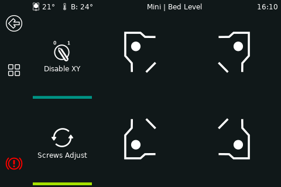

# Bed level

For this panel to appear in the menu `[bed_screws]` or `[screws_tilt_adjust]` need to be defined in Klipper config (printer.cfg)

!!! Important
    * `[bed_screws]` uses nozzle positions (nozzle above the screw) [Read Klipper doc entry](https://www.klipper3d.org/Config_Reference.html#bed_screws)
    * `[screws_tilt_adjust]` uses probe positions (probe above the screw) [Read Klipper doc entry](https://www.klipper3d.org/Config_Reference.html#screws_tilt_adjust)

The corner buttons in KlipperScreen place the nozzle above the screw to do the ["paper test"](https://www.klipper3d.org/Bed_Level.html?h=paper#the-paper-test).

When `[screws_tilt_adjust]` is defined a couple of things happen:

* A button named "Screws adjust" appears, it runs `SCREWS_TILT_CALCULATE` when is pressed,
and reports the amount to be adjusted into the labels of the corner buttons.
* `[bed_screws]` is now ignored by KlipperScreen. (explained below)
* The corner buttons are now `[screws_tilt_adjust]` coordinates with the probe offset applied. (explained below)

### Why `[bed_screws]` are ignored/not used?

Because if the probe offset is changed or the difference between `[bed_screws]` and `[screws_tilt_adjust]` wasn't calculated correctly,
the "Screws adjust" button stops working.

### Why the probe offset is applied to `[screws_tilt_adjust]`?

Because the corner buttons in KlipperScreen should place the nozzle above the screw to do the ["paper test"](https://www.klipper3d.org/Bed_Level.html?h=paper#the-paper-test). It doesn't affect the function of `SCREWS_TILT_CALCULATE`, which will go to the defined positions.

## Not supported for auto-detection

This message will appear if you are using 3 or 5 screws and didn't define them in KlipperScreen.conf.
See "screw_positions" in the [printer options](https://klipperscreen.readthedocs.io/en/latest/Configuration/#printer-options)

## Limitations

The panel doesn't support more than 9 screws. if there is a center screw define the positions to avoid issues.
See "screw_positions" in the [printer options](https://klipperscreen.readthedocs.io/en/latest/Configuration/#printer-options)

## Is there an alternative?

If you have a reliable probe, define `[bed_mesh]` in Klipper config, remove the springs
and use some thread-locker or locking nuts to fix the bed to the gantry, let the probe do a mesh save it and forget about this.
