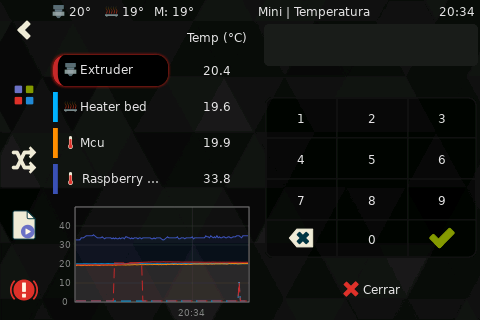

# Temperature

This panel is available when there is at least one device with a temperature sensor asociated,
this includes extruders, heaters, sensors and temperature_fans.

There are 3 main modes of operation:

## Preheat
[Define profiles](Configuration.md#preheat-options) to quickly change the target temperature of multiple selected devices.
This is the default mode when not printing.

## Delta adjust
Change the target of the selected devices, the amount is selectable.
This is the default mode while printing

## Direct input with keypad
Allows to set the exact temperature using the keypad.

