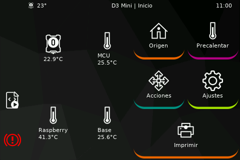

# Theming

To create a custom theme, create a folder in: _${KlipperScreen_Directory}/styles/_

The folder name will be the theme name, in that folder create another folder named `images` this is where the icons should be placed. The icons must be SVG files and they need to have specific names that are defined in the code, use the default theme as a reference for the names or check the code.

To edit colors and styles, create a css file named `style.css` you can use the contents of another theme as a reference.

### Example 1

```sh
cd ~/KlipperScreen/styles
mkdir -p mytheme/images
cd mytheme
cp ../z-bolt/images/* images/
echo "window { background-color: red;}" > style.css
sudo service KlipperScreen restart
```

At this point `mytheme` should be on the list of themes, and when you select it the background should be red.


### Example 2

Creating a custom background from Mainsail sidebar and this css using Z-bolt icons

```css
window { background-image: url("/home/pi/mainsail/img/background.svg");}
button {background-color: rgba(0,0,0,0); border-radius:2em;}
```



