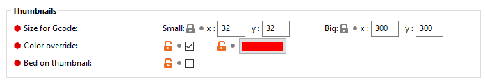

# Thumbnails
KlipperScreen can display thumbnails in the file browser and as previews in the print status.

Recommended sizes for thumbnails:

* 300 x 300 - For the larger previews.
* 32 x 32   - For the smaller thumbnails used in lists.

!!! note
    Other sizes should work, but keep in mind bigger thumbnails are slower to load and can produce bigger gcode files.

## Select your slicer:
* [PrusaSlicer](#prusaslicer)
* [SuperSlicer](#superslicer)
* [Cura](#cura)
* [ideaMaker](#ideamaker)

### PrusaSlicer (2.3.0+)
In “Expert” mode PrusaSlicer has an option in the “Printer Settings” tab to activate previews.
Under General / Firmware.

### SuperSlicer (2.2.54+)
In “Expert” mode SuperSlicer has some very convenient options in the “Printer Settings” tab to activate and customize the previews.

### Cura

#### Option #1 A post processing script (Cura 4.9+)

1. With Cura open, navigate to Extensions, Post Processing, Modify G-Code
2. Click Add a script, and select Create Thumbnail
3. Set both Width and Height to 300
4. Click Add a script, and select Create Thumbnail
5. Set both Width and Height to 32
6. Click Close

#### Option #2 A plugin  (Cura 4.7+)

[Cura2Moonraker](https://github.com/emtrax-ltd/Cura2MoonrakerPlugin)

### ideaMaker (4.2.1+)
1. Open the Advanced tab in the printer settings
2. Enable "GCode Thumbnails for Octoprint and Mainsail"
3. Set both Width and Height to 300

