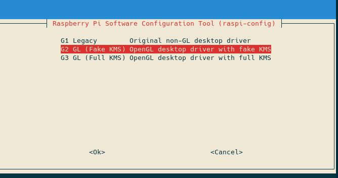

This page will have common problems and common solutions to those problems.

# First Steps

The first step to troubleshooting any problem is getting the cause of the error.

* Check for the file `/tmp/KlipperScreen.log`

look at the contents by running `cat /tmp/KlipperScreen.log` or grab the file over WinSCP or another sftp program.
This is the most important file, and should be provided if you ask for support.

If that file is non-existent, run `journalctl -xe -u KlipperScreen`

Check the file `/var/log/Xorg.0.log` where you can find issues with the X server.

## Cannot open virtual Console
```
xf86OpenConsole: Cannot open virtual console 2 (Permission denied)
```

* Run `cat /etc/X11/Xwrapper.config`

This should have the line `allowed_users=anybody` in it

* Run `cat /etc/group | grep tty`

If your username is not listed under that line, you need to add it with the following command:

`usermod -a -G tty pi` (if your username is not 'pi' change 'pi' to your username)

If it's still failing, try: `sudo apt install xserver-xorg-legacy`

As a last resort add `needs_root_rights=yes` to `/etc/X11/Xwrapper.config`

## Screen shows console instead of KlipperScreen

If you have multiple framebuffers, you may need to fix the X11 configuration.

`ls /dev/fb*` will list the available framebuffers

`cat /usr/share/X11/xorg.conf.d/99-fbturbo.conf | grep /dev/fb` will show you the current one

If you have another fb, try changing it:

`sudo nano /usr/share/X11/xorg.conf.d/99-fbturbo.conf`

for example: change `/dev/fb0` to `/dev/fb1`

Once you have saved that file, restart KlipperScreen and it should show up on your display.

## Screen is all white or blank or no signal

If the screen never shows the console even during startup, Then it's tipically an improperly installed screen,
follow the manufacturer instructions on how to physically connect the screen and install the proper drivers.

## Touch not working on debian Bullseye

Some dsi screens have issues where touch doesn't work with debian bullseye, the current fix
(at least until upstream is fixed) consist in changing the driver:

Run `raspi-config` > go to Advanced > GL Driver > select G2 and reboot.



Or manually edit `/boot/config.txt` and change:

`dtoverlay=vc4-kms-v3d`

to:

`dtoverlay=vc4-fkms-v3d`

and reboot, that should make the touch work, if your screen is rotated 180 degrees, then you may need to adjust
[the touch rotation](Hardware.md) as described in the Hardware page.

## Other issues

If you found an issue not listed here, or can't make it work, please provide all the log files
a description of your hw, and a description of the issue when asking for support.
