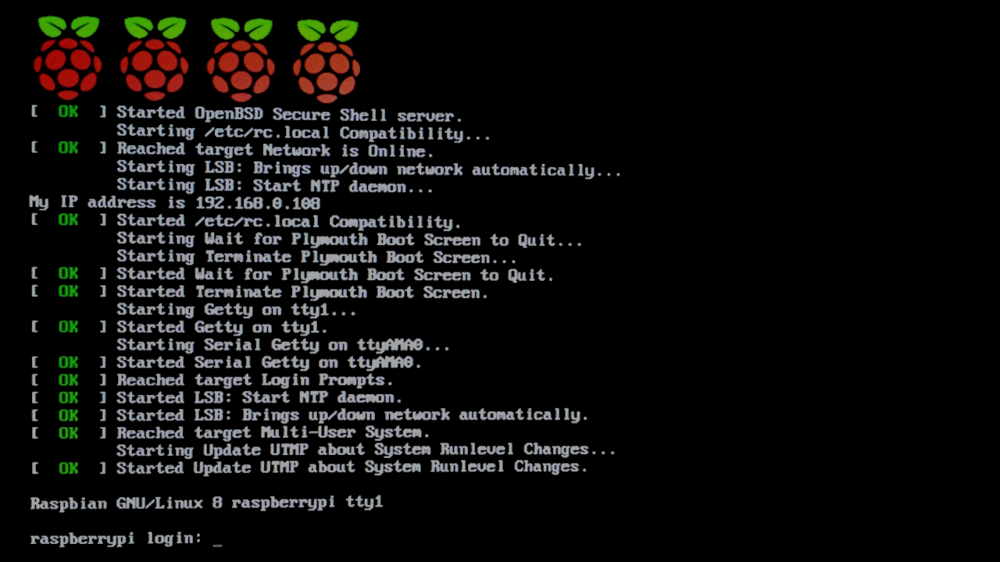

# Troubleshooting

## First Steps

The first step to troubleshooting any problem is getting the cause of the error.

* Find KlipperScreen.log:

!!! warning "Important"
    This log file should be provided if you ask for support.

Depending on your setup the file could be accessible from the web interface alongside other logs

Mainsail | Fluidd
:-:|:-:
 | 

if you can't find it in the web interface, use sftp to grab the log (for example Filezilla, WinSCP)
Located at `~/printer_data/logs`or in `/tmp/` if the former doesn't exist.

## System logs

If [KlipperScreen.log](#first-steps) doesn't exist:
```sh
systemctl status KlipperScreen
```
or
```sh
journalctl -xe -u KlipperScreen
```

Also the Xorg log where you can find issues with the X server:
```sh
cat /var/log/Xorg.0.log
```

## Screen shows console instead of KlipperScreen




!!! abstract "If you see this line in the [system logs](#system-logs):"
    ```sh
    xf86OpenConsole: Cannot open virtual console 2 (Permission denied)
    ```
    [Follow this steps](Troubleshooting/VC_ERROR.md)

!!! abstract "If you see this line in the [system logs](#system-logs):"
    ```sh
    xinit[948]: /usr/lib/xorg/Xorg: symbol lookup error: /usr/lib/xorg/modules/drivers/fbturbo_drv.so: undefined symbol: shadowUpdatePackedWeak
    ```
    [Follow this steps](Troubleshooting/FBturbo.md)

!!! abstract "If you see this line in the [system logs](#system-logs):"
    ```sh
    KlipperScreen-start.sh: (EE) no screens found(EE)
    ```
    [First check the screen](Troubleshooting/Physical_Install.md)

    [Maybe it's the wrong framebuffer](Troubleshooting/Framebuffer.md)

## Screen is always white / black / blank or no 'No signal'

If the screen never shows the console even during startup, Then it's typically an improperly installed screen.

[Follow this steps](Troubleshooting/Physical_Install.md)


## The screen shows colors or 'No signal' when idle

In KliperScreen settings find 'Screen DPMS' and turn it off.


Your screen doesn't seem to support turning off via software.

KlipperScreen will enable an internal screensaver to make it all black, and hopefully avoid burn-in.
If you find a way of turning it off and you want to share it: [Contact](Contact.md)

## Touch issues


[Follow this steps](Troubleshooting/Touch_issues.md)

## Network panel doesn't list WI-FI networks

[Follow this steps](Troubleshooting/Network.md)

## OctoPrint

KlipperScreen was never intended to be used with OctoPrint, and there is no support for it.

## Other issues

If you found an issue not listed here, or can't make it work, please provide all the log files
a description of your hw, and a description of the issue when [asking for support](Contact.md)
