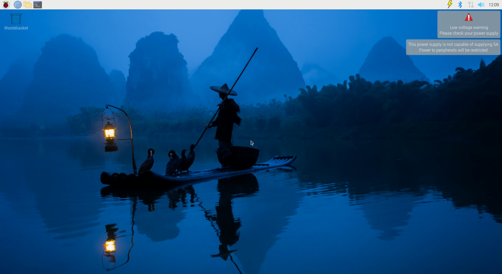
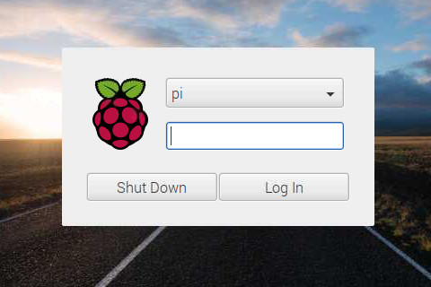
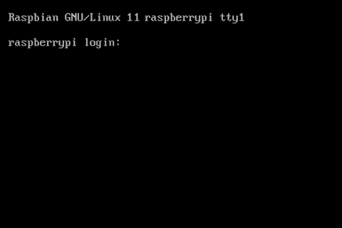

#### Check if You Have a Desktop Environment
1. Let you device finish startup
2. At the end of the boot process look at the screen and check using this examples


|            Desktop environment             |                   Console                    |
|:------------------------------------------:|:--------------------------------------------:|
|   |      |
|            Desktop environment             |                   Console                    |
|  |  |


If you installed a desktop (GUI version) of the OS and want to run KlipperScreen exclusively then do:
```sh title="Boot to console / KlipperScreen"
sudo systemctl set-default multi-user.target && sudo reboot
```
to undo and go back to the desktop environment:
```sh title="Boot to the desktop"
sudo systemctl set-default graphical.target && sudo reboot
```