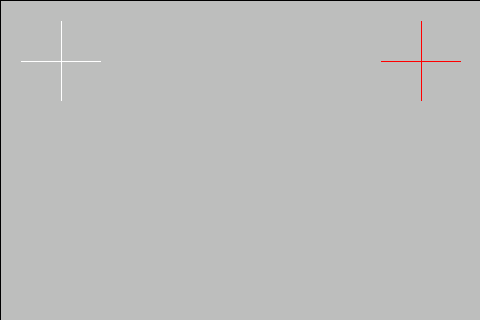

# Touchscreen issues

Contents:

* [Touch not working](#touch-not-working)
* [Touch rotation and matrix](#touch-rotation-and-matrix)
* [Touch calibration](#touch-calibration)

Beware that this document focuses on RaspberryOS but most of it should apply to any other Debian based distros

## Touch not working

If the screen is connected over USB, the cable may cause issues.
For that, please see [this guide](Physical_Install.md#cable-issues).


??? abstract "DSI screens touch not working on RaspberryOS / MainsailOS version Debian 11 Bullseye"

    Some DSI screens have issues where touch doesn't work with the default configuration.
    The current workaround/temporary fix involves changing the kernel driver module used for these displays.

    `sudo nano /boot/config.txt` and change

    ```sh
    dtoverlay=vc4-kms-v3d
    ```

    to

    ```sh
    dtoverlay=vc4-fkms-v3d
    ```

    Close the nano editor using `ctrl`+`x` (exit), then `y` for yes (save).

    **Reboot** to apply changes. `sudo reboot`

    If that doesn't fix it, you can try commenting these lines out, resulting in:

    ```sh
    # dtoverlay=vc4-kms-v3d
    # max_framebuffers=2
    ```

    **Reboot** to apply changes. `sudo reboot`

## Touch rotation and matrix

If the touch works but registers touch input in a different location from the input, then you may need to apply an input transformation matrix.

First you will need your device name. On a terminal, run:

```sh
DISPLAY=:0 xinput
```
??? tip "Alternative"
    ```
    libinput list-devices
    ```
    !!! note
        requires libinput-tools
        ```
        sudo apt install libinput-tools
        ```
Output:

```text
⎡ Virtual core pointer                          id=2    [master pointer  (3)]
⎜   ↳ Virtual core XTEST pointer                id=4    [slave  pointer  (2)]
⎜   ↳ ADS7846 Touchscreen                       id=6    [slave  pointer  (2)]
⎣ Virtual core keyboard                         id=3    [master keyboard (2)]
    ↳ Virtual core XTEST keyboard               id=5    [slave  keyboard (3)]
```

In this case the device is the ADS7846 Touchscreen, yours may be different

You can test a change by running:

```sh
DISPLAY=:0 xinput set-prop "<device name>" 'Coordinate Transformation Matrix' <matrix>
```

!!! example
    ```sh
    DISPLAY=:0 xinput set-prop "ADS7846 Touchscreen" 'Coordinate Transformation Matrix' -1 0 1 0 -1 1 0 0 1
    ```

Where the matrix can be one of the following options:

| Rotation                                | Matrix                |
|-----------------------------------------|-----------------------|
| 0°                                      | `1 0 0 0 1 0 0 0 1`   |
| 90° Clockwise                           | `0 -1 1 1 0 0 0 0 1`  |
| 90° Counter-Clockwise                   | `0 1 0 -1 0 1 0 0 1`  |
| 180° (Inverts X and Y)                  | `-1 0 1 0 -1 1 0 0 1` |
| invert Y                                | `-1 0 1 1 1 0 0 0 1`  |
| invert X                                | `-1 0 1 0 1 0 0 0 1`  |
| expand to twice the size horizontally   | `0.5 0 0 0 1 0 0 0 1` |

To make the calibration permanent read [Save touch calibration](#save-touch-calibration)

## Touch calibration

This is optional, and you should only do it if you are having problems.

Download and build xtcal:

```sh
sudo apt-get install libxaw7-dev libxxf86vm-dev libxft-dev
cd
git clone https://github.com/KurtJacobson/xtcal
cd xtcal
make
cd ..
```

First you will need your touchscreen device name. On a terminal, run:

```sh
DISPLAY=:0 xinput
```
??? tip "Alternative"
    ```
    libinput list-devices
    ```
    !!! note
        requires libinput-tools
        ```
        sudo apt install libinput-tools
        ```
Output:

```text
⎡ Virtual core pointer                          id=2    [master pointer  (3)]
⎜   ↳ Virtual core XTEST pointer                id=4    [slave  pointer  (2)]
⎜   ↳ ADS7846 Touchscreen                       id=6    [slave  pointer  (2)]
⎣ Virtual core keyboard                         id=3    [master keyboard (2)]
    ↳ Virtual core XTEST keyboard               id=5    [slave  keyboard (3)]
```

In this case the device is the ADS7846 Touchscreen, yours may be different

Reset the old calibration: (set the 0° roation matrix: 1 0 0 0 1 0 0 0 1)
```sh
DISPLAY=:0 xinput set-prop "ADS7846 Touchscreen" 'Coordinate Transformation Matrix' 1 0 0 0 1 0 0 0 1
```
Run the calibrator - if it's not fullscreen cancel with `ctrl`+`c` and adjust geometry
```sh
DISPLAY=:0 xtcal/xtcal -geometry 480x320
```

!!! important
    KlipperScreen or a desktop environment should be on the screen to launch the calibrator

Touch the center of the crosses in order, they should turn white.



### Test the calibration

Copy the output of the calibration and test it, For example:
```sh
DISPLAY=:0 xinput set-prop "ADS7846 Touchscreen" 'Coordinate Transformation Matrix' -0.016267 -0.952804 0.978336 -1.010164 0.065333 0.998316 0 0 1
```
if it's not correct reset the matrix and run xtcal again.


## Save touch calibration

modify `/etc/udev/rules.d/51-touchscreen.rules`:

```sh
sudo nano /etc/udev/rules.d/51-touchscreen.rules
```

```sh title="51-touchscreen.rules"
ACTION=="add", ATTRS{name}=="<device name>", ENV{LIBINPUT_CALIBRATION_MATRIX}="<matrix>"
```

Close the nano editor using `ctrl`+`x` (exit), then `y` for yes (save).

```sh
sudo reboot
```

!!! example

    ```sh
    sudo nano /etc/udev/rules.d/51-touchscreen.rules
    ```

    ```sh title="51-touchscreen.rules"
    ACTION=="add", ATTRS{name}=="ADS7846 Touchscreen", ENV{LIBINPUT_CALIBRATION_MATRIX}="-1 0 1 0 -1 1 0 0 1"
    ```

    Close the nano editor using `ctrl`+`x` (exit), then `y` for yes (save).
    ```sh
    sudo reboot
    ```


!!! example "Alternative Example"

    As an alternative **if the above doesn't work**:

    determine the touchscreen driver (usually libinput):

    ```bash
    cat /var/log/Xorg.0.log
    ```

    ```bash title="example of /var/log/Xorg.0.log"
    ...
    (II) Using input driver 'libinput' for 'ADS7846 Touchscreen'
    ...
    ```

    if it says `evdev` instead, then change `libinput` to `evdev` below, both in the filename and in the file

    ```bash
    sudo nano /usr/share/X11/xorg.conf.d/40-libinput.conf
    ```

    ```sh title="40-libinput.conf"
    Section "InputClass"
            Identifier "libinput touchscreen catchall"
            MatchIsTouchscreen "on"
            MatchDevicePath "/dev/input/event*"
            Driver "libinput"
            Option "TransformationMatrix" "0 -1 1 1 0 0 0 0 1"
    EndSection
    ```

    !!! note
        the number of the filename determines the order of loading, if you have issues
        check if there are other files overriding your config or just use 99-touch_calibration.conf as a name.

    Close the nano editor using `ctrl`+`x` (exit), then `y` for yes (save).
    ```sh
    sudo reboot
    ```

For more in-depth guidance on using Coordinate Transformation Matrices:

* [Ubuntu wiki InputCoordinateTransformation](https://wiki.ubuntu.com/X/InputCoordinateTransformation)
* [Libinput docs](https://wayland.freedesktop.org/libinput/doc/1.9.0/absolute_axes.html)
