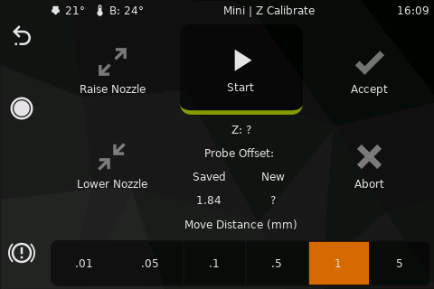

# Zcalibrate
This panel supports various modes of operation to assist in the calibration of the Z axis of the machine.
It's strongly suggested to read Klipper documentation about [Bed level](https://www.klipper3d.org/Bed_Level.html)

## Buttons
* "Start" will initiate the only method available, or ask the user if multiple methods are available.
!!! note
    KlipperScreen will home if needed and move to the middle of the bed,
    but the location can be configured in [KlipperScreen.conf](https://klipperscreen.readthedocs.io/en/latest/Configuration/#printer-options)
* The raise(+) and lower(-) buttons send `TESTZ Z=distance` where distance is selected in the bottom row.
* Accept will send `ACCEPT`
* Abort will send `ABORT`

## Calibration methods
### Endstop (`Z_ENDSTOP_CALIBRATE`)
Available when an physical endstop is defined for `[stepper_z]`

See Klipper documentation: [Calibrating a Z endstop](https://www.klipper3d.org/Manual_Level.html#calibrating-a-z-endstop)

### Probe (`PROBE_CALIBRATE`)
Available when a probe is defined. (BL-Touch is a probe)

See Klipper documentation: [Calibrating probe Z offset](https://www.klipper3d.org/Probe_Calibrate.html#calibrating-probe-z-offset)

### Bed mesh (`BED_MESH_CALIBRATE`)
Available when a probe is not defined and `[bed_mesh]` is defined

this mode lets you create a mesh leveling bed using the paper test in various points.

!!! warning
    DO NOT adjust the bed screws while using this mode.

    Adjust the screws using the [bed screws](Screws.md) panel before running this tool.

### Delta Automatic/Manual (`DELTA_CALIBRATE`)
Available when the kinematics are defined as delta.

See Klipper documentation: [Delta calibration](https://www.klipper3d.org/Delta_Calibrate.html)

!!! note
    KlipperScreen will automatically Home(`G28`) if needed
