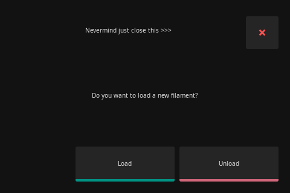

# Macros

## Recommended

!!! note
     If you have already installed other UIs then you may have these macros already, and it's usually asked by KIAUH

None of the following macros are strictly required for KlipperScreen, but they provide the toolhead parking at pause and cancel.

These can be assumed sane defaults, but should be checked and modified to your own needs.


### Pause
```yaml+jinja title="printer.cfg"
[gcode_macro PAUSE]
description: Pause the actual running print
rename_existing: PAUSE_BASE
gcode:
  PAUSE_BASE
  _TOOLHEAD_PARK_PAUSE_CANCEL
```

### Resume
```yaml+jinja title="printer.cfg"
[gcode_macro RESUME]
description: Resume the actual running print
rename_existing: RESUME_BASE
gcode:
  ##### read extrude from  _TOOLHEAD_PARK_PAUSE_CANCEL  macro #####

  
  #### get VELOCITY parameter if specified ####
  
    
  
    
  
  ##### end of definitions #####
  
    M83
    G1 E{extrude} F2100
     M82 
  
    {action_respond_info("Extruder not hot enough")}
  

  RESUME_BASE {get_params}
```

### Park

```yaml+jinja title="printer.cfg"
[gcode_macro _TOOLHEAD_PARK_PAUSE_CANCEL]
description: Helper: park toolhead used in PAUSE and CANCEL_PRINT
variable_extrude: 1.0
gcode:
  ##### set park positon for x and y #####
  # default is your max posion from your printer.cfg

  
  
  
  ##### calculate save lift position #####
  
  
  
    
  
    
  
  ##### end of definitions #####
  
    M83
    G1 E-{extrude} F2100
     M82 
  
    {action_respond_info("Extruder not hot enough")}
  
  
    G91
    G1 Z{z_safe} F900
    G90
    G1 X{x_park} Y{y_park} F6000
     G91 
  
    {action_respond_info("Printer not homed")}
  
```

### Cancel

```yaml+jinja title="printer.cfg"
[gcode_macro CANCEL_PRINT]
description: Cancel the actual running print
rename_existing: CANCEL_PRINT_BASE
variable_park: True
gcode:
  ## Move head and retract only if not already in the pause state and park set to true

  
    _TOOLHEAD_PARK_PAUSE_CANCEL
  

  TURN_OFF_HEATERS
  CANCEL_PRINT_BASE
```

## Extrude Panel

### LOAD_FILAMENT / UNLOAD_FILAMENT

These macros are used in the Extrude panel `Load` and `Unload` buttons. and they will be hidden from the macros panel.

The selected speed in the panel is transferred as a parameter.

The following examples show how this can be used:

```yaml+jinja title="  printer.cfg"
[gcode_macro LOAD_FILAMENT]
variable_load_distance:  50
variable_purge_distance:  25
gcode:
    
    
    SAVE_GCODE_STATE NAME=load_state
    G91
    G92 E0
    G1 E{load_distance} F{max_velocity} # fast-load
    G1 E{purge_distance} F{speed} # purge
    RESTORE_GCODE_STATE NAME=load_state
```

!!! warning
    `variable_load_distance` will depend on the printers distance from the extruder to the nozzle.

    For printers with long bowden tubes you may have to increase the extrude only distance in the configfile

    ```ini title="  printer.cfg"
    [extruder]
    max_extrude_only_distance: 600 # default is 50mm
    ```


```yaml+jinja title="  printer.cfg"
[gcode_macro UNLOAD_FILAMENT]
variable_unload_distance:  50
variable_purge_distance:  25
gcode:
    
    
    SAVE_GCODE_STATE NAME=unload_state
    G91
    G92 E0
    G1 E{purge_distance} F{speed} # purge
    G1 E-{unload_distance} F{max_velocity} # fast-unload
    RESTORE_GCODE_STATE NAME=unload_state
```

if it loads too fast and your extruder can't keep up, you should adjust the `max_extrude_only_velocity` in `printer.cfg`


## Hidden by the interface

All gcode_macros with the attribute `rename_existing` are hidden , because these are default Klipper Gcodes
and these should be implemented in KlipperScreen itself with buttons already.
[This is the same behaiviour of other UIs](https://docs.mainsail.xyz/overview/features/hide-macros-outputs-or-fans#macros-with-rename_existing)

[LOAD_FILAMENT and UNLOAD_FILAMENT are also hidden](#load_filament-unload_filament)

## Hide Macros

Macros can be completely hidden in the interface by prefixing the name with an underscore.

```yaml+jinja title="  printer.cfg"
[gcode_macro MY_AWESOME_GCODE]
gcode:
    _MY_HELPER_CODE

[gcode_macro _MY_HELPER_CODE]
gcode:
    M300
```

`MY_AWESOME_GCODE` appears in your interface settings, but `_MY_HELPER_CODE` does not.


## Prompts

It allows macros in Klipper to trigger dialog prompts to interact with the Firmware and will enable
the user to choose between options or to close the dialog again in case it's no longer needed.

!!! warning
    This feature needs the `[respond]` module of Klipper.

    So please check if this is enabled in your Klipper config.

### Supported Macro prompt commands

Begin the prompt and set a title:

```yaml+jinja title="Start"
RESPOND TYPE=command MSG="action:prompt_begin My Prompt"
```

Add a button:

`prompt_button` or `prompt_footer_button`

The options are label | gcode | style

Supported styles: primary, secondary, info, warning, error

```yaml+jinja title="Add a button"
RESPOND TYPE=command MSG="action:prompt_button button_text|RESPOND MSG=test|info"
```

!!! info
    Only 4 footer buttons are allowed, the rest will not show due to screen space concerns

Show the prompt on the screen:
```yaml+jinja title="Show"
RESPOND TYPE=command MSG="action:prompt_show"
```

Optional: Close the Prompt:
```yaml+jinja title="Close"
RESPOND TYPE=command MSG="action:prompt_end"
```

Groups:
Footer buttons will be displayed on the same row,
but regular buttons will default to 1 per row,
to display them in the same row group them:

```yaml+jinja title="Group Start"
RESPOND TYPE=command MSG="action:prompt_button_group_start"
```

add buttons and then:

```yaml+jinja title="Group End"
RESPOND TYPE=command MSG="action:prompt_button_group_end"
```

### Examples

```yaml+jinja
[gcode_macro SHOW_PROMPT]
gcode:
    RESPOND TYPE=command MSG="action:prompt_begin My Prompt"
    RESPOND TYPE=command MSG="action:prompt_text This is an example of a prompt"
    RESPOND TYPE=command MSG="action:prompt_button primary|G28|primary"
    RESPOND TYPE=command MSG="action:prompt_button secondary|RESPOND MSG=test|secondary"
    RESPOND TYPE=command MSG="action:prompt_button info|RESPOND MSG=test #2|info"
    RESPOND TYPE=command MSG="action:prompt_button warning|RESPOND MSG=test #3|warning"
    RESPOND TYPE=command MSG="action:prompt_show"
```


```yaml+jinja
[gcode_macro SHOW_PROMPT_2]
gcode:
    RESPOND TYPE=command MSG="action:prompt_begin Nevermind just close this >>>"
    RESPOND TYPE=command MSG="action:prompt_text Do you want to load a new filament?"
    RESPOND TYPE=command MSG="action:prompt_footer_button Load|LOAD_FILAMENT"
    RESPOND TYPE=command MSG="action:prompt_footer_button Unload|UNLOAD_FILAMENT|error"
    RESPOND TYPE=command MSG="action:prompt_show"
```


## KlipperScreen actions

!!! warning
    this should be considered experimental

Show a panel:
```
RESPOND TYPE=command MSG="action:ks_show extrude"
```

Show a menu with items:

!!! note
    you need to escape double quotes because they are used by MSG

```
RESPOND TYPE=command MSG="action:ks_show menu items=[{'save': {'name': 'Home', 'icon': 'home', 'panel': None, 'method': 'printer.gcode.script', 'enable': 'True', 'params': '{\"script\": \"G28\"}', 'style': None, 'confirm': None}}]"
```