# Panels

### Main Menu
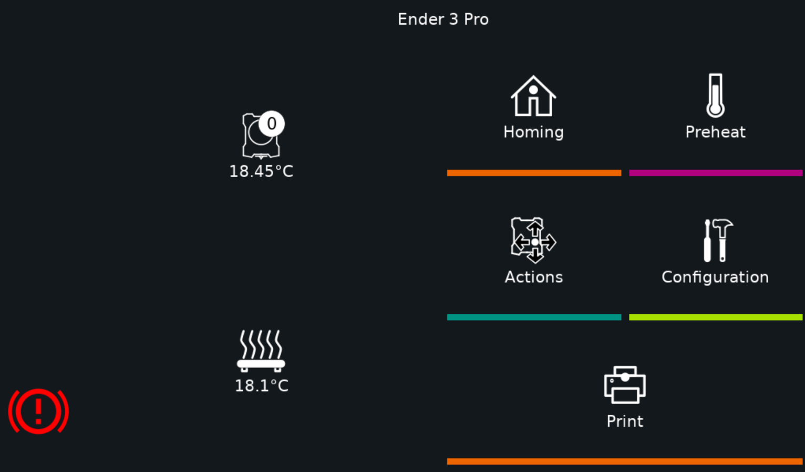

### Job Status
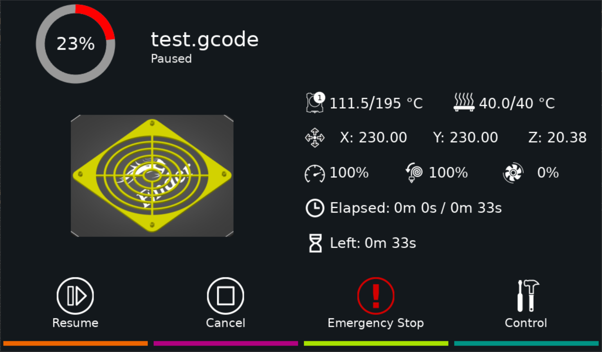

### Bed Level
type: bed_level
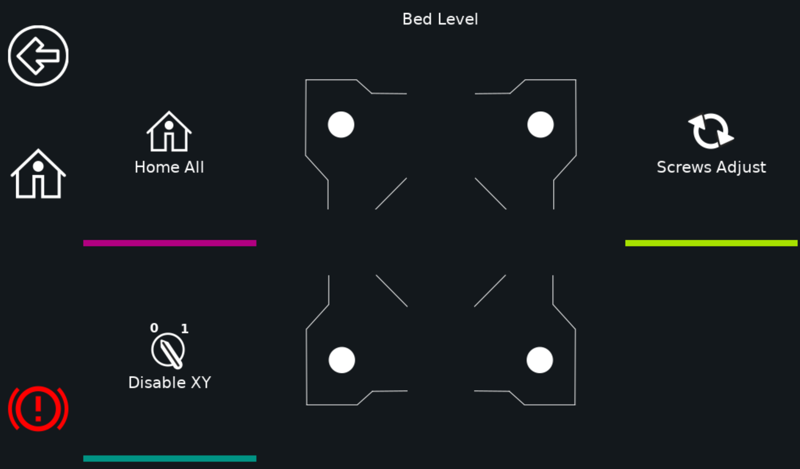

The bed level panel has the ability to have preset locations from Klipper. Please see documentation on the following
Klipper Sections:
* [bed_screws](https://github.com/KevinOConnor/klipper/blob/master/docs/Config_Reference.md#bed_screws)
* [screws_tilt_adjust](https://github.com/KevinOConnor/klipper/blob/master/docs/Config_Reference.md#screws_tilt_adjust)

_Important Note: Due to Klipper using the bltouch/probe offsets in screws_tilt_adjust, if a bltouch/probe is enabled_
_KlipperScreen will add the offset to the defined screw values. This will not occur if bed_screws section is used._

This panel will favor screws_tilt_adjust over the bed_screws section. If screws_tilt_adjust is defined, an extra button
for _Screws Calibrate_ will appear. This button runs the SCREWS_TILT_CALCULATE command and shows the results on the
panel.

### Bed Mesh
type: bed_mesh
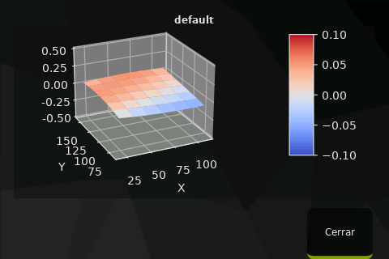

### Extrude
type: extrude
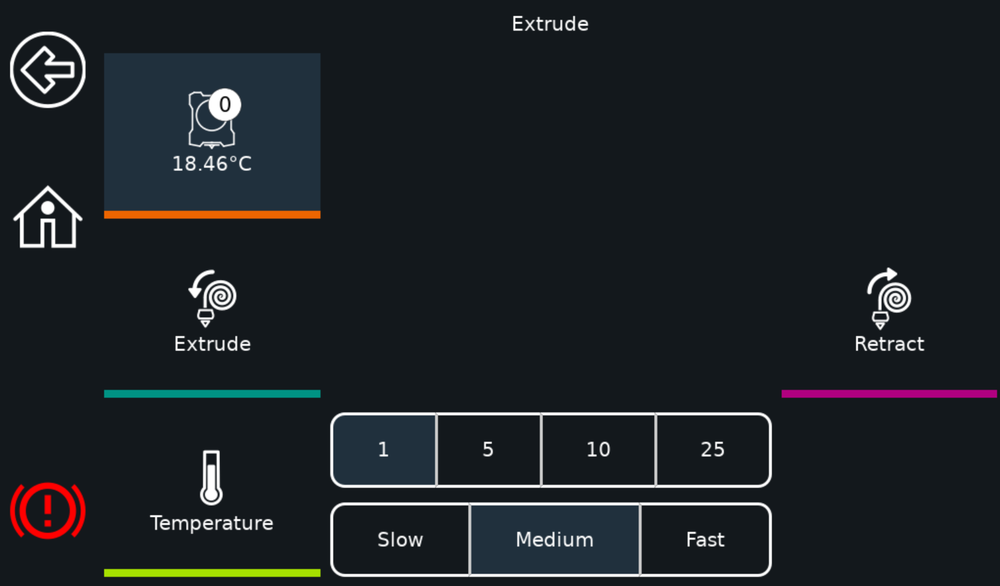

### Fan
type: fan
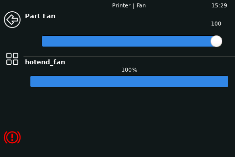

### Fine Tune
type: fine_tune
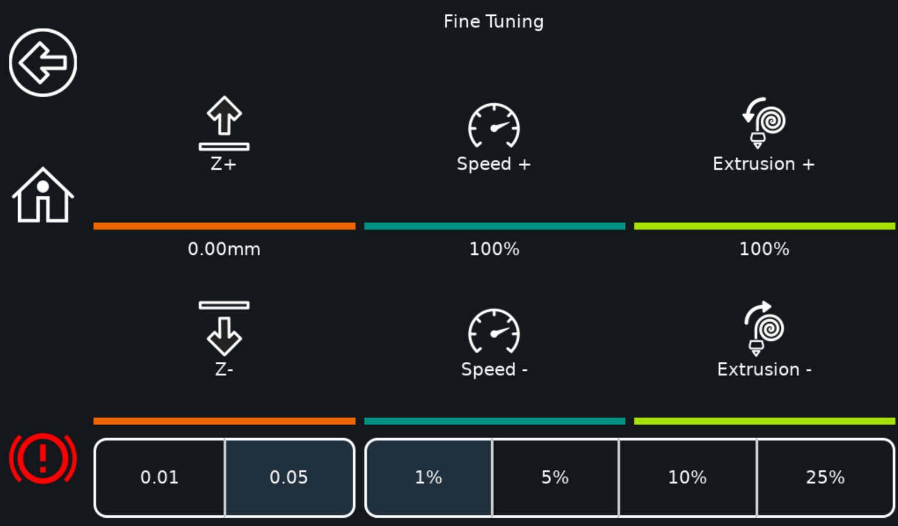

### Gcode Macros
type: gcode_macros
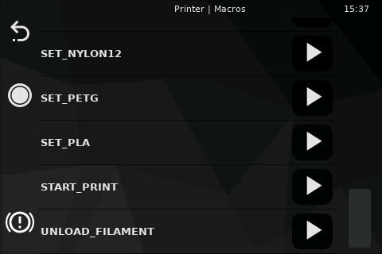

### Menu
type: menu
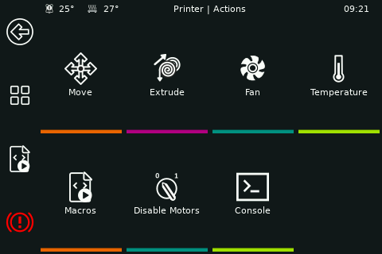

### Move
type: move
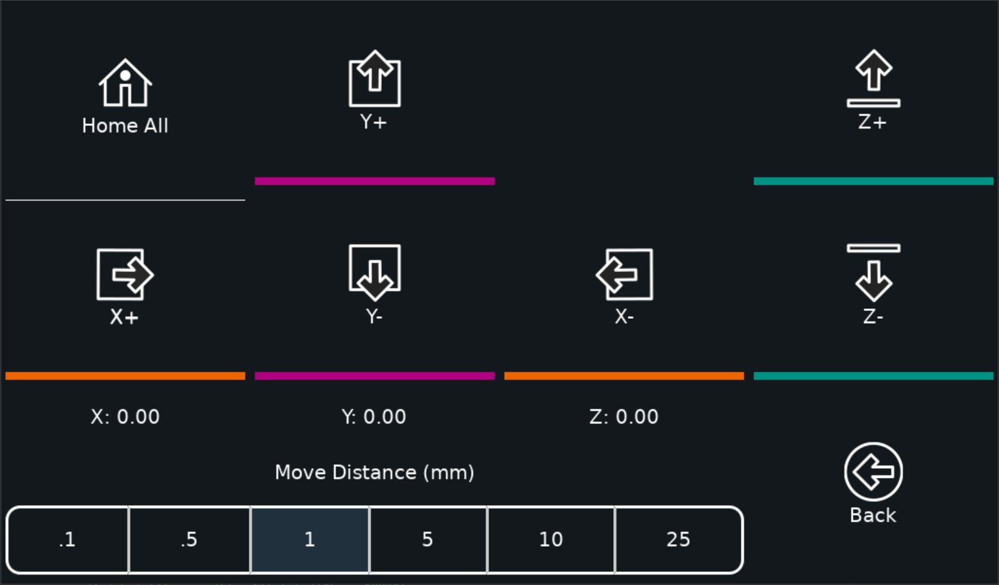

### Network
type: network
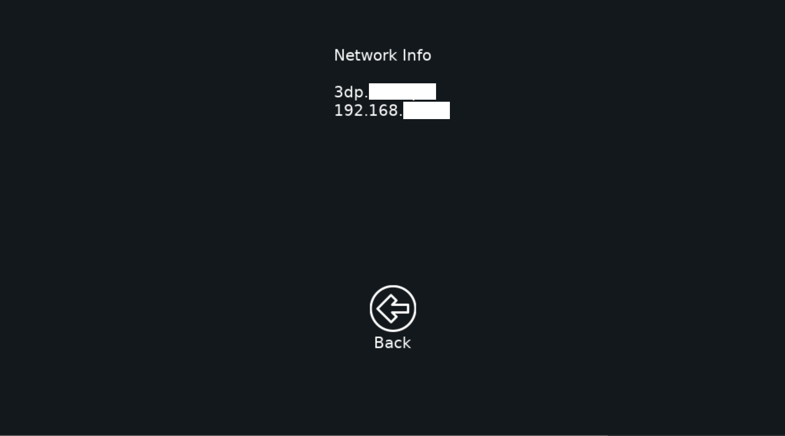

### Power
type: power
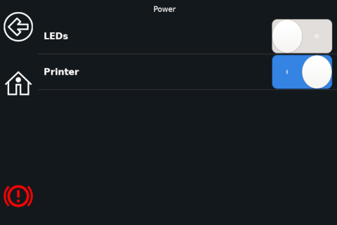

### Preheat
type: preheat
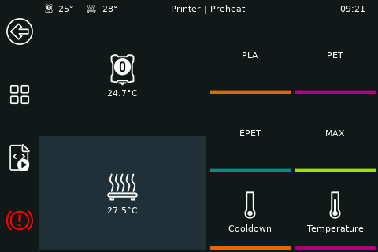

### Print
type: print
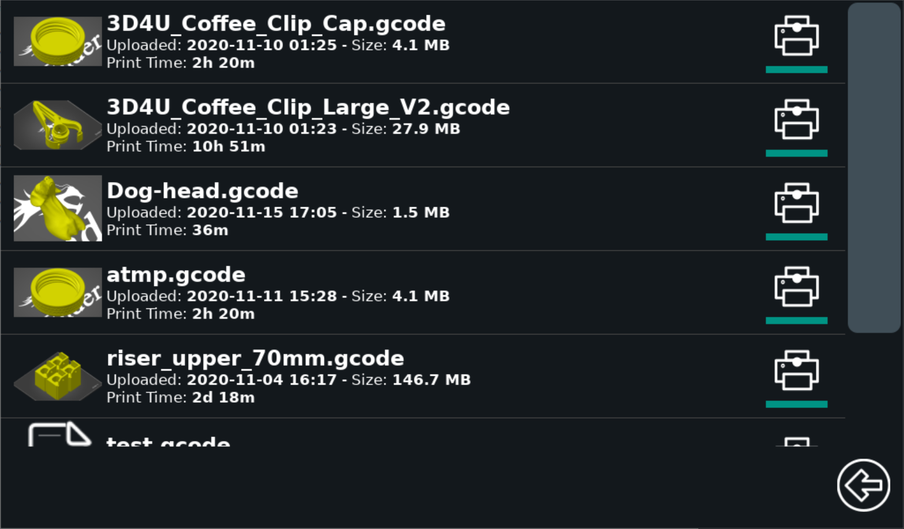

### Settings
type: settings
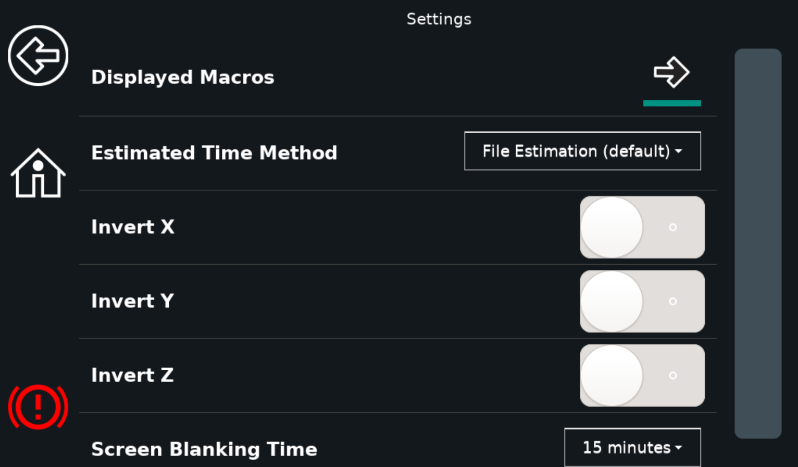

### System
type: system
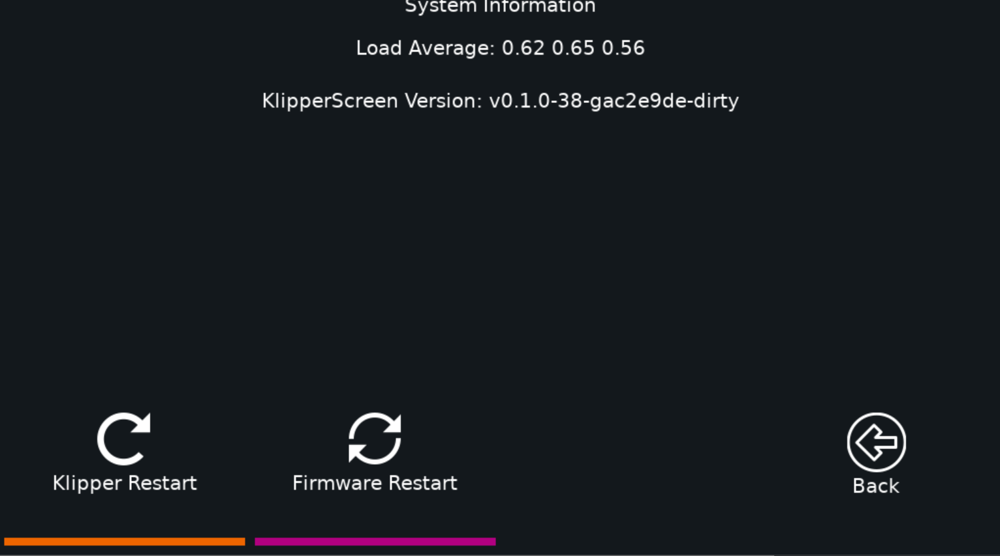

### Temperature
type: temperature
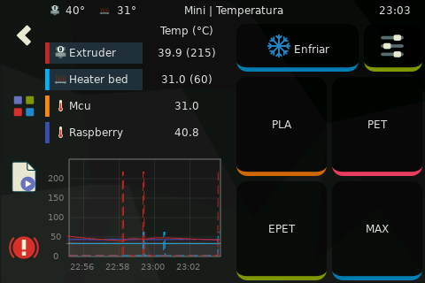

### Z Calibrate
type: zcalibrate
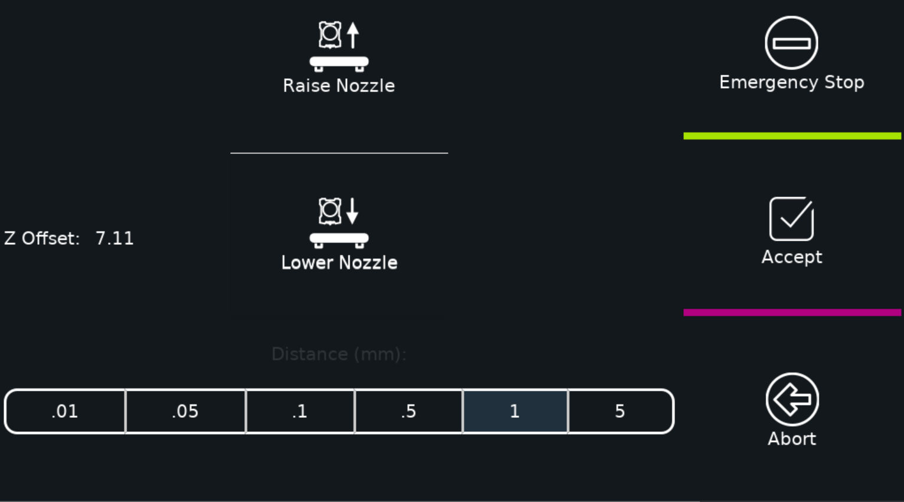
