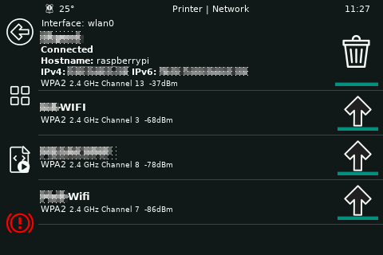

## Panels

### Index
* [Main menu](#main-menu)
* [Job Status](#job-status)
* [bed_level](#bed-level)
* [extrude](#extrude)
* [fan](#fan)
* [fine_tune](#finetune)
* [move](#move)
* [network](#network)
* [preheat](#preheat)
* [print](#print)
* [system](#system)
* [temperature](#temperature)
* [zcalibrate](#zcalibrate)

### Main Menu

### Job Status

### Bed Level
type: bed_level

### Extrude
type: extrude

### Fan
type: fan

### Fine Tune
type: fine_tune

### Menu
type: menu

### Move
type: move

### Network
type: network

### Preheat
type: preheat

### Print
type: print

### System
type: system

### Temperature
type: temperature

### Z Calibrate
type: zcalibrate

